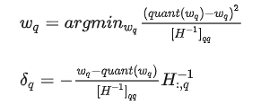

# 大模型技术栈-算法与原理
- 1. tokenizer方法
    - word-level
    - char-level
    - subword-level
        - BPE
        - WordPiece
        - UniLM
        - SentencePiece
        - ByteBPE
- 2. position encoding
    - 绝对位置编码
        - ROPE
        - AliBi
    - 相对位置编码
        - Transformer-XL
        - T5/TUPE
        - DeBERTa
- 3.  注意力机制
    - Mamba,H3,Hyena,RetNet,RWKV,Linear attention, Sparse attention
- 4. 分布式训练
    - 数据并行
        - FSDP
        - DDP
        - ZeRO
            - Model state
                - Optimizer->ZeRO1
                    - 将optimizer state分成若干份，每块GPU上各自维护一份
                    - 每块GPU上存一份完整的参数W,做完一轮foward和backward后，各得一份梯度,对梯度做一次 **AllReduce（reduce-scatter + all-gather）** ， **得到完整的梯度G,由于每块GPU上只保管部分optimizer states，因此只能将相应的W进行更新,对W做一次All-Gather**
                - Gradient+Optimzer->ZeRO2
                    - 每个GPU维护一块梯度
                    - 每块GPU上存一份完整的参数W,做完一轮foward和backward后， **算得一份完整的梯度,对梯度做一次Reduce-Scatter，保证每个GPU上所维持的那块梯度是聚合梯度,每块GPU用自己对应的O和G去更新相应的W。更新完毕后，每块GPU维持了一块更新完毕的W。同理，对W做一次All-Gather，将别的GPU算好的W同步到自己这来**
                - Parameter+Gradient+Optimizer->ZeRO3
                    - 每个GPU维护一块模型状态
                    - 每块GPU上只保存部分参数W，做forward时，对W做一次 **All-Gather** ，取回分布在别的GPU上的W，得到一份完整的W， **forward做完，立刻把不是自己维护的W抛弃，做backward时，对W做一次All-Gather，取回完整的W，backward做完，立刻把不是自己维护的W抛弃. 做完backward，算得一份完整的梯度G，对G做一次Reduce-Scatter，从别的GPU上聚合自己维护的那部分梯度,聚合操作结束后，立刻把不是自己维护的G抛弃。用自己维护的O和G，更新W。由于只维护部分W，因此无需再对W做任何AllReduce操作**
            - Residual state
                - activation->Partitioned Activation Checkpointing
                    - 每块GPU上只维护部分的activation，需要时再从别的地方聚合过来就行。需要注意的是，activation对显存的占用一般会远高于模型本身，通讯量也是巨大的
                - temporary buffer->Constant Size Buffer
                    - 提升带宽利用率。当GPU数量上升，GPU间的通讯次数也上升，每次的通讯量可能下降（但总通讯量不会变）。数据切片小了，就不能很好利用带宽了。所以这个buffer起到了积攒数据的作用：等数据积攒到一定大小，再进行通讯。
                    - 使得存储大小可控。在每次通讯前，积攒的存储大小是常量，是已知可控的。更方便使用者对训练中的存储消耗和通讯时间进行预估
                - unusable fragment->Memory Defragmentation
                    - 对碎片化的存储空间进行重新整合，整出连续的存储空间。防止出现总存储足够，但连续存储不够而引起的存储请求fail
            - offload
                - ZeRO-Offload
                    - **forward和backward计算量高** ，因此和它们相关的部分，例如参数W（fp16），activation，就全放入GPU
                    - **update的部分计算量低** ，因此和它相关的部分，全部放入CPU中。例如W(fp32)，optimizer states（fp32）和gradients(fp16)等
                    - ZeRO-Offload 分为 Offload Strategy 和 Offload Schedule 两部分，前者解决如何在 GPU 和 CPU 间划分模型的问题，后者解决如何调度计算和通信的问题
                - ZeRO-Infinity
                    - 一是将offload和 ZeRO 的结合从 ZeRO-2 延伸到了 ZeRO-3，解决了模型参数受限于单张 GPU 内存的问题
                    - 二是解决了 ZeRO-Offload 在训练 batch size 较小的时候效率较低的问题
                    - 三是除 CPU 内存外，进一步尝试利用 NVMe 的空间
    - 模型并行
        - tensor-wise parallelism
        - pipeline parallelism: GPipe,1F1B,interleaved 1F1B
        - sequence parallelism
    - MoE
- 5. PEFT
    - Lora类
        - LoRA
            - 用两个低秩矩阵替代待更新的权重矩阵的增量
        - QLoRA
            - 4 bit NormalFloat(NF4) 量化和双量化
            - 引入了分页优化器，以防止梯度检查点期间的内存峰值
        - AdaLoRA
            - 用奇异值分解P \ Gamma Q代替AB，根据loss梯度评估对角线上值进行重要性评分，根据评分动态分配参数预算给权重矩阵
            - AdaLoRA将关键的增量矩阵分配高秩以捕捉更精细和任务特定的信息，而将较不重要的矩阵的秩降低，以防止过拟合并节省计算预算。
            - 以奇异值分解的形式对增量更新进行参数化，并根据重要性指标裁剪掉不重要的奇异值，同时保留奇异向量。
            - 在训练损失中添加了额外的惩罚项，以规范奇异矩阵P和Q的正交性，从而避免SVD的大量计算并稳定训练
        - IA3
            - 通过学习向量来对激活层加权进行缩放
            - 学习到的向量被注入到attention和feedforward模块中
        - ReLoRA
            - **ReLoRA在合并和重新启动期间可以对优化器进行部分重置** ，并在随后的预热中过程中将学习率设置为0。 **具体来说，作者提出了一种锯齿状学习率调度算法**
            - 出发点：通过不断叠加LoRA训练过程来达到更好的训练效果， **首先需要对LoRA过程进行重新启动，想要对已经完成的LoRA过程重新启动并不容易，这需要对优化器进行精细的调整，如果调整不到位，会导致模型在重启后立即与之前的优化方向出现分歧**
    - Prompt类
        - prompt tuning
            - 在输入层加一个embedding层
        - P-tuning
            - 在输入层加一个embedding和一个LSTM或MLP
        - prefix tuning
            - 在每一层加入一个embedding和一个MLP
        - P-tuning v2
            - 在每一层都加一个embedding层
    - Adapter类
        - Adapter Tuning
            - 针对每一个Transformer层，增加了两个Adapter结构(分别是多头注意力的投影之后和第二个feed-forward层之后)
        - Adapter Fusion
            - 在 Adapter 的基础上进行优化，通过将学习过程分为两阶段来提升下游任务表现
            - 知识提取阶段：在不同任务下引入各自的Adapter模块，用于学习特定任务的信息。
            - 知识组合阶段：将预训练模型参数与特定于任务的Adapter参数固定，引入新参数（AdapterFusion）来学习组合多个Adapter中的知识，以提高模型在目标任务中的表现
        - Adapter Drop
            - 在不影响任务性能的情况下，对Adapter动态高效的移除，尽可能的减少模型的参数量，提高模型在反向传播（训练）和正向传播（推理）时的效率
    - 其他
        - BitFit
            - 疏的微调方法，它训练时只更新bias的参数或者部分bias参数
    - 混合式
        - MAM Adapter
            - 用 FFN 层的并行Adapter和软提示的组合
        - UniPELT
            - 门控被实现为线性层，通过GP参数控制Prefix-tuning方法的开关，GL控制LoRA方法的开关，GA控制Adapter方法的开关
- 6. 压缩
    - 剪枝
        - OBD(Optimal Brain Damage)
            - 利用二阶导数信息度量模型参数的显著性，剪掉影响小的参数降低模型复杂度提高泛化能力
            -  
        - OBS（Optimal Brain Surgeon ）
            - OBD粗暴的只考虑海森矩阵对角线元素。OBS考虑海森矩阵全局信息，由此也获得参数相互之间的影响。
        - OBC（OPTIMAL BRAIN COMPRESSION ）
            - OBS对整个神经网络进行剪枝，OBC对神经网络模型分层剪枝或者量化
        - ExactOBS
            - 参数更新和代价评估不需要使用整个海森矩阵，仅使用和剪枝参数所在行相关的 d_col\time d_col大小的海森矩阵。
    - 量化 
        - GPTQ
            - 1.是对OBC的改进
            - 2. 取消了贪心算法，采用固定位置优化
            - 3. 分组量化，并行加速
            -  
        - SpQR
            - 核心思想：参数的对模型的重要程度，存在极强的不均衡性。1%的参数，可能主导的量化过程中损失的性能，假如我们在量化中保护这1%的参数，就能极大程度保护模型的性能不受影响
            - 2. 对于每一层，它使用一个小的输入数据集X，用来计算单个参数w_ij被量化前后造成的的误差s_ij. 有了s_ij之后再取top 1%的参数认为它们是重要参数进行保护。
            - 在挑选出参数之后，SqQR使用一个稀疏矩阵来单独保存这些参数，令这些重要参数的精度仍为fp16。
            - SqQR在实验中还观察到重要参数往往以行或者列聚集，因此提出使用更小的group_size比如8或16，而非GPTQ中常用的128
        - AWQ
            - 1. AWQ是在smoothquant的基础上提出来的
            - 2. AWQ针对channel维度来寻找重要参数，依据是输入X以及这个参数本身W的绝对大小
            - 3.方式是寻找一个缩放比例s，在参数量化之前W乘以这个比例，计算时输入X除以这个比例，以减小误差
            - 4. 把s分成两个值S_x和S_w相乘，我们需要W越大s越小，X越大，s越大
            -  
        - OBC（OPTIMAL BRAIN COMPRESSION ）
            -  
        - SmoothQuant
            - 1. 当模型规模更大时，单个token的值变化范围较大，难以量化，相比之下 weight 的变化范围较小，即 weight 较易量化，而 activation 较难量化
            - 2. SmoothQuant 核心思想是引入一个超参，减小激活值的变化范围，增大权重的变化范围，从而均衡两者的量化难度
            - 3. 得到smooth变换之后的 activation 和 weight 矩阵，可以再采用 per-token 或 per-tensor 的量化方式，
            -  
        - LLM.int8
            - 采用混合精度分解的量化方法：将包含了Emergent Features的几个维度从矩阵中分离出来，对其做高精度的矩阵乘法；其余部分进行量化
        - ZeroQuant
            - 1. 对权重使用分组量化，对激活使用token量化
            - 2. 开发了高度优化的推理后端，消除了量化/反量化运算符昂贵的计算成本，在现代GPU硬件上实现INT8 Tensor内核的延迟加速
            - 3. 提出了一种用于INT4/INT8混合精度量化的新的逐层知识蒸馏方法（LKD），其中神经网络通过蒸馏逐层量化，迭代最小，甚至不访问原始训练数据
        - 分类学
            - 对称量化vs非对称量化
                - 量化是否均衡，原点是否为0
            - 动态量化vs静态量化
                - 输入的缩放因子计算方法不同
                - 静态量化的模型在使用前有“calibrate”的过程（校准缩放因子），量化模型的缩放因子会根据输入数据的分布进行调整
            - Weights量化vsActivation量化
                - feature map(fm)就是每一层网络的输入tensor，featuremap量化就是我们常说的激活量化
            - per-token vs. per-layer/per-tensor vs. per channel vs. per group vs
                - **per-token quantization** :激活每个token对应的tensor共享量化系数
                - **per-tensor quantization** : 对一整个tensor设置简单的量化集合
                - **per-channel quantization** : 对权重的每个输出通道设置一个量化集合，但实际中feature 还是整个 tensor 共用一个 scale 和 zeropoint，但每个 kernel 会单独统计一个 scale 和 zeropoint（注意是每个 kernel，而不是 kernel 的每个 channel）
                - **group-wise quantization** : 把多个channel合在一起用一组量化系数
    - 蒸馏(layer reduction)
- 7. 推理
    - 7.1 吞吐量与显存优化
        - PagedAttention
        - Qunatized KV Cache
        - MQA/GQA
        - FlashAttention
        - FlashAttention-Decoding
    - 7.2 算子融合
    - 7.4 调度优化
        - Dynamic Batching
        - Async Servering
        - Inflight/continuous/iterative-level Batching
        - sarathi/dynamic spltfuse
    - 7.5 量化
    - 7.6 模型并行
        - TP,PP
    - 7.7 请求优化
        - rpc
        - grpc
        - http
- 8. 应用
    - RAG
    - Agent
- 9. embedding模型
    - 分类学
        - 对称vs. 非对称 vs. 混合
            - 对称 query:qestion, text:text
                - sentence-T5
            - 非对称:query:text
                - GTR
            - 混合
                - Instructor
        - 对比学习+对比学习 vs. 自编码+对比学习
            - 对比学习+对比学习
                - sentence-T5
                - GTR
                - E5
            - 自编码+对比学习
                - bge
                - retromae
        - bert-based vs. GPT-based
            - bert-based
            - LLM-based
                - PromptEOL+CSE+LLM
    - Bert-CLS,Bert-mean
        - 双向decoder-encoder的Transformer
    - T5 series
        - Sentence-T5
            - T5-encoder+mean pooling
            - 无标注对比学习+有标注对比学习的两阶段训练
        - Jina
            - 以T5为基本架构
            - 去重、语言过滤、一致性过来
            - **采用了并行化方法在多个数据集上进行训练** ，但设计了一个约束条件：每个训练批次（batch）仅包含来自单一数据集的样本
            - 三元组训练：enchor,entainment, contraversive
        - GTR
            - 与sentence-T5结构相同
            - 将finetune的数据集从NLI换成检索相关的，并且利用百度的rocketqa来获得hard negative
            - 对比学习改成双向对比学习（每个batch里有两个对比学习损失，第一个损失是以query为中心去构建正负样本，第二个损失是以positive document为中心去构建正负样本）
    - simcse
        - 无监督Simcse
            - 对于同一条语句，在训练中使用两次不同的dropout mask，把两次dropout后的句子对视为一组互为正例的样本对，即相似句子对
            - "不相似句子对"通过采样同一批（batch）内的其余句子即可
        - 有监督simcse
            - 采用NLI有监督数据集做对比学习训练,NLI，即自然语言推理，其任务是判断两句话之间的关系，可能的关系有entailment (相近), contradiction (矛盾)或neutral (中立)。
            - entailment sentence pair作为正例， contradiction sentence pair作为hard negative样本
        - 衍生算法
            - Esimcse
                - ESimCSE选择在句子中随机重复一些单词作为正样本，解决模型倾向于判断相同或相似长度的句子在表达上更相近的问题
                - 维护了一个队列，重用前面紧接的mini-batch的编码嵌入来扩展负对，并使用了动量编码器
            - CoSENT
                - 在正负样本的基础上，基于circle loss进一步引入排序
            - SNCSE
                - 针对模型「无法区分文本相似度和语义相似度，更偏向具有相似文本，而不考虑实际语义差异」的问题，提出了一种「显式添加否定词从而生成软负样本」结合「双向边际损失」的方案。
            - EASE
                - 强调实体在句向量表征中的重要性。在数据层面，使用正、负实体代替正负样本。
            - CLAIF
                - 针对训练过程中缺乏细粒度的监督信号， 即没有考虑到正样本对之间的相似性差异，引入来自LLM的AI反馈，构造具有不同相似度的样本对，并对这些样本对给出细粒度的相似度分数作为监督信号，帮助文本表示的学习。
    - Instructor
        - 1. 以GTR为基底模型，经过进一步的“instruction tuning”得到
        - 2. 将模型输入改成Task Instuction+[X]([X]代表具体的文本输入)
    - E5
        - E5提出了一个预训练数据过滤的方案consistency-based filter
        - 以Bert为基座的embedding模型
        - 在模型输入侧加入了Prefix("query:"跟“paragraph:”)，从而让模型知道文本的类型，跟Instructor的instruction类似
    - BGE
        - 基于RetroMAE方案
        - BGE在finetune阶段针对检索任务需要加入特定的Prefix(只在query侧加"Represent this sentence for searching relevant passages:")
    - RetroMAE
        - 包括一个以Bert为基底的Encoder跟一个只有一层的Decoder
        - Encoder端以30%的比例对原文本进行mask，最终得到最后一层[CLS]位置的向量表征作为句向量
        - Decoder端则以50%的比例对原文本进行mask，联合Encoder端的句向量，对原本进行重建
    - PromptBert
        - 以Bert为基底，通过选择合适的prompt（“This sentence:"[X]" means [MASK] ”）,然后以最后一层[MASK]位置的向量表征作为句向量，即便不经过额外的finetune也能取得令人惊艳的效果
    - PromptEOL+CLS+LLM
        - 语言模型使用的是OPT跟LLaMA
        - 构建了另一个新的prompt,"This sentence:”[X]” means in one word:"，以下一个生成token的隐层状态作为text embedding
        - 还引入了in-context learning，为每个语言模型找到了一个最佳的demonstration，从而指导语言模型生成更符合要求的text embedding
        - 为了进一步提升性能，可以采用对比学习的方式作进一步的finetune
- 10. 上下文扩展
    - Alibi
    - log（n）注意力缩放
    - window attention
    - RoPE改进
        - Interpolation
            - Position Interpolation
            - 线性插值
        - Extrapolation
            - NTK感知缩放RoPE
            - dynamic缩放RoPE
            - consistent of Dynamically Scaled RoPE
        - 混合
            - Rectified RoPE
    - **N** aive **B** ayes-based **C** ontext **E** xtension
        - 只需要修改一下解码函数中的logits构建方式
        - 即插即用、模型无关、无须微调、线性效率、实现简单
        - NBCE的一大缺点是无序性，即无法识别Context的输入顺序，这在续写故事等场景可能表现欠佳
- 11. Prompt Engineering
    - **Chain of Thought**
        - Let’s Think step by step
    - **Self-Consistency**
        - Few-shot + {question} 用几个相似的具有推导步骤的例子
    - **Auto-CoT**
        - Few-shot + {question} +Chain of Thought相似的具有推导步骤的例子+{问题}+给出具体思考过程。
    - **Generation Knowledge**
        - 以事实+知识的方式组织样例，再最后提问，要求给出解释和答案
    - **Automatic Prompt Engineer**
        - Let's work this out in a step by step way to be sure we have the right answer
    - **OPRO**
        - “Take a deep breath and think step by step.”
        - Optimization by PROmpting (OPRO)总体架构：最开始输入meta-prompt，这个初始的meta-prompt基本上只是对优化任务进行了描述(也会有few-shot example)。输入后LLM便会生成一个solution，这个solution由objective function评估并打分。(solution, score)组合成一对添加到meta-prompt中，如此完成一个循环。多次循环后取分数最高的solution作为优化结果。
        - meta-prompt分为两部分，问题描述和优化轨迹，问题描述就是用自然语言描述想要优化的问题，比如“generate a new instruction that achieves a higher accuracy”。而优化弹道（Optimization trajectory）则是指之前提到的(solution, score)对，即之前生成的解决方案和对应的分数，可以看作优化的“日志”。但是要注意这个弹道不是按 排的，而是按照打分升序排的。因为之前的研究也发现，越靠后的样例对输出的影响越大，所以把分数高的排在后面有利于LLM向其学习。 [时间顺序]("https://so.csdn.net/so/search?q=%E6%97%B6%E9%97%B4%E9%A1%BA%E5%BA%8F&spm=1001.2101.3001.7020")
    - **Tree of Thought**
        - f“给定当前的推理状态：‘{state_text}’，生成{k}条连贯的思想来实现推理过程：”
        - f“鉴于当前的推理状态：‘{state_text}’，根据其实现 {initial_prompt} 的潜力悲观地将其值评估为 0 到 1 之间的浮点数”
        - 利用树的遍历算法（BFS, DFS, MC,BF,A*），搜索最佳答案。
    - **Graph of Thought**
        - 创新点是将大模型生成的信息建模为一个图，节点是 “LLM的思想“，边是这些思想的依赖关系。这种方法能够将任意 LLM 思想，组合，提取出这个网络的思想本质。
        - **出发点** ：人类的思维在解决问题时，不是只会链式思维或者尝试不同的链（TOT）,而是在脑中构建一个复杂的思维网络。人类在思考时会沿着一个链式的推理，回溯，再尝试一个新的方向，并把之前的链的优点保留，缺点剔除，与当前探索的链的方向结合生成一个新的解决方案